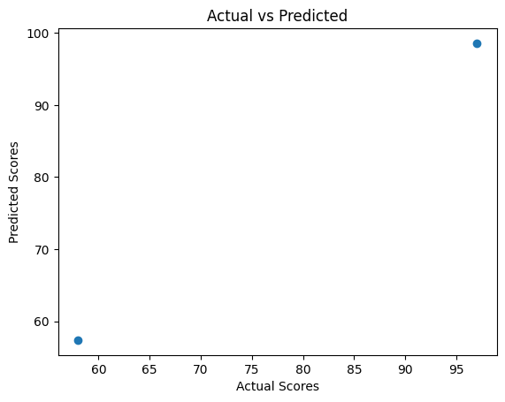

```python
import pandas as pd
import numpy as np
import matplotlib.pyplot as plt
import seaborn as sns
from sklearn.model_selection import train_test_split
from sklearn.linear_model import LinearRegression
from sklearn.preprocessing import StandardScaler
from sklearn.metrics import mean_squared_error, r2_score
import joblib
```


```python
df = pd.read_csv("student_data.csv")
df.head()
```


<div>
<style scoped>
    .dataframe tbody tr th:only-of-type {
        vertical-align: middle;
    }

    .dataframe tbody tr th {
        vertical-align: top;
    }

    .dataframe thead th {
        text-align: right;
    }
</style>
<table border="1" class="dataframe">
  <thead>
    <tr style="text-align: right;">
      <th></th>
      <th>Hours_Studied</th>
      <th>Attendance</th>
      <th>Past_Grades</th>
      <th>Final_Score</th>
    </tr>
  </thead>
  <tbody>
    <tr>
      <th>0</th>
      <td>5</td>
      <td>90</td>
      <td>78</td>
      <td>82</td>
    </tr>
    <tr>
      <th>1</th>
      <td>2</td>
      <td>60</td>
      <td>55</td>
      <td>58</td>
    </tr>
    <tr>
      <th>2</th>
      <td>3</td>
      <td>75</td>
      <td>65</td>
      <td>65</td>
    </tr>
    <tr>
      <th>3</th>
      <td>4</td>
      <td>80</td>
      <td>70</td>
      <td>72</td>
    </tr>
    <tr>
      <th>4</th>
      <td>6</td>
      <td>95</td>
      <td>88</td>
      <td>89</td>
    </tr>
  </tbody>
</table>
</div>


```python
X = df.drop("Final_Score", axis=1)
y = df["Final_Score"]
X_train, X_test, y_train, y_test = train_test_split(X, y, test_size=0.2, random_state=42)
scaler = StandardScaler()
X_train = scaler.fit_transform(X_train)
X_test = scaler.transform(X_test)
model = LinearRegression()
model.fit(X_train, y_train)
joblib.dump(model, "student_score_model.pkl")
joblib.dump(scaler, "scaler.pkl")
```


    ['scaler.pkl']


```python
y_pred = model.predict(X_test)
print("R² Score:", r2_score(y_test, y_pred))
print("Mean Squared Error:", mean_squared_error(y_test, y_pred))
plt.scatter(y_test, y_pred)
plt.xlabel("Actual Scores")
plt.ylabel("Predicted Scores")
plt.title("Actual vs Predicted")
plt.show()
```

    R² Score: 0.9962985504603445
    Mean Squared Error: 1.4074761874539978
    


    

    


```python
df_new = pd.read_csv("new_student_data.csv")
model = joblib.load("student_score_model.pkl")
scaler = joblib.load("scaler.pkl")
X_new = scaler.transform(df_new)
predictions = model.predict(X_new)
df_new["Predicted_Final_Score"] = predictions
df_new
```


<div>
<style scoped>
    .dataframe tbody tr th:only-of-type {
        vertical-align: middle;
    }

    .dataframe tbody tr th {
        vertical-align: top;
    }

    .dataframe thead th {
        text-align: right;
    }
</style>
<table border="1" class="dataframe">
  <thead>
    <tr style="text-align: right;">
      <th></th>
      <th>Hours_Studied</th>
      <th>Attendance</th>
      <th>Past_Grades</th>
      <th>Predicted_Final_Score</th>
    </tr>
  </thead>
  <tbody>
    <tr>
      <th>0</th>
      <td>6</td>
      <td>92</td>
      <td>85</td>
      <td>87.295565</td>
    </tr>
    <tr>
      <th>1</th>
      <td>4</td>
      <td>80</td>
      <td>70</td>
      <td>72.311933</td>
    </tr>
    <tr>
      <th>2</th>
      <td>7</td>
      <td>95</td>
      <td>90</td>
      <td>92.931879</td>
    </tr>
  </tbody>
</table>
</div>


```python
df_new.to_csv("predicted_scores.csv", index=False)
print("Predictions saved to predicted_scores.csv")
```

    Predictions saved to predicted_scores.csv
    


```python

```
